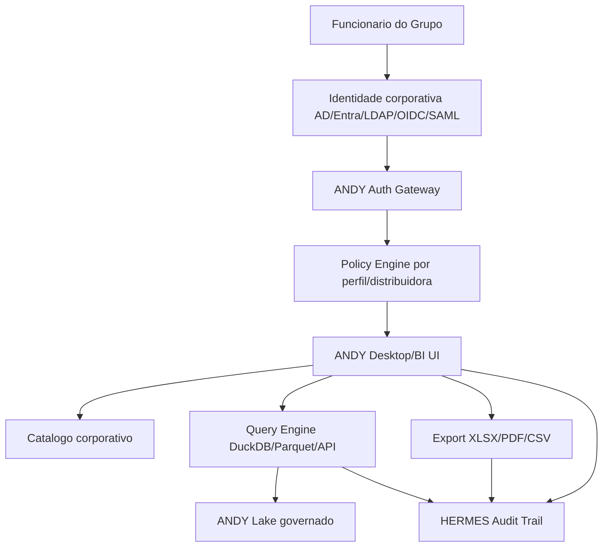

# ANDY BI Equatorial Roadmap

Data: 2026-07-07

## 1. Visao executiva

O ANDY pode evoluir de ferramenta desktop local de engenharia para um BI corporativo de dominio eletrico do Grupo Equatorial, mantendo a engine analitica existente e adicionando camadas corporativas de identidade, governanca, catalogo, seguranca, multi-distribuidora e publicacao controlada de resultados.

A diretriz mais importante: o ANDY nao deve guardar login e senha de funcionario. O caminho correto e integrar com o provedor de identidade corporativo, como Active Directory, Entra ID/Azure AD, LDAP, SAML ou OpenID Connect, conforme a TI do Grupo definir.

Modelo alvo:

```text
Funcionario autentica no provedor corporativo
-> ANDY recebe identidade e grupos autorizados
-> ANDY aplica escopo por distribuidora/estado/perfil
-> ANDY consulta dados autorizados
-> ANDY exibe BI, filtros, dashboards e exports
-> HERMES/auditoria registra acesso, criterio, consulta e exportacao
```

## 2. Principios obrigatorios

- Nao armazenar senha corporativa dentro do ANDY.
- Nao compartilhar credenciais de banco, rede ou API em instaladores.
- Separar autenticao de autorizacao.
- Toda consulta/exportacao deve ser auditavel.
- Cada distribuidora deve ter escopo de dados claro.
- Dados reais continuam fora do repositorio.
- O BI deve preservar a regra analitica eletrica existente.
- Exportacao deve indicar origem, filtros, usuario, data, versao da regra e dataset.
- Usuario ve apenas o que seu perfil permite.

## 3. Escopo do ANDY BI

O ANDY BI deve cobrir:

- Catalogo corporativo de fontes.
- Sincronizacao controlada de medicoes.
- Lake local ou corporativo em DuckDB/Parquet, com governanca.
- Perfil por distribuidora, estado, area, subestacao, alimentador, equipamento e terminal.
- Dashboards eletricos: patamar, fluxo PQ, inversao, disponibilidade, consistencia, qualidade de leitura e comparativos.
- Exportacao XLSX padronizada.
- Historico de analises.
- Auditoria de consultas e exports.
- Suporte a operacao offline/local quando autorizado.

Fora do escopo inicial:

- Substituir sistemas oficiais da empresa.
- Criar base mestre de usuarios.
- Guardar senha de funcionario.
- Editar dados operacionais originais.
- Automatizar decisoes reguladas sem revisao humana.

## 4. Arquitetura alvo



Camadas recomendadas:

- **Identity Gateway**: recebe token corporativo, nao senha.
- **Policy Engine**: resolve permissoes por usuario, grupo, estado, distribuidora e papel.
- **Domain Catalog**: registra fontes, schemas, cadencias, aliases e perfil eletrico de cada distribuidora.
- **Query/BI Layer**: executa consultas e dashboards com filtros autorizados.
- **Audit/HERMES**: registra eventos e evidencias.
- **Export Governance**: aplica marca, trilha, versao, hash e restricoes de compartilhamento.

## 5. Modelo de identidade e acesso

### Fase inicial recomendada

Usar SSO corporativo sempre que possivel.

Opcoes aceitaveis:

- OpenID Connect via Entra ID/Azure AD.
- SAML com provedor corporativo.
- Kerberos/Windows Integrated Authentication em ambiente de dominio.
- LDAP/Active Directory apenas se a TI exigir, com bind seguro e sem persistir senha.

Nao recomendado:

- Banco local de usuarios e senhas.
- Senha salva em arquivo `.env`, JSON, SQLite ou config.
- Usuario generico compartilhado.
- Token sem expiracao.

### Claims/grupos necessarios

O ANDY deve receber ou derivar:

- identificador do usuario;
- nome exibivel;
- e-mail ou matricula corporativa;
- grupos corporativos;
- distribuidoras autorizadas;
- estados autorizados;
- permissoes de leitura;
- permissao de exportacao;
- permissao de administracao de fontes;
- permissao de suporte/diagnostico.

## 6. Modelo multi-distribuidora

Criar um cadastro de dominio, versionado sem dados sensiveis:

```text
Distribuidora
Estado
Codigo interno
Aliases
Raiz de fonte autorizada
Cadencia padrao
Schema esperado
Colunas canonicas
Regras de filtros
Regras de exportacao
Politica de retencao
Responsavel tecnico
```

Exemplos de perfis que o ANDY ja vem preparando em conceito:

- RS/CEEE sintetico.
- MA sintetico.
- PA sintetico.
- Futuras distribuidoras via arquivo privado revisado.

Regra: o app nao deve ter caminho corporativo hardcoded. Caminhos reais devem vir de policy privada ou servico corporativo.

## 7. Dominios funcionais do BI

### Catalogo

- fontes autorizadas por usuario;
- status de sincronizacao;
- disponibilidade por ano/mes/cadencia;
- schema detectado;
- divergencias de nomenclatura;
- data da ultima atualizacao.

### Exploracao

- filtros cascatais por distribuidora, estado, ano, mes, cadencia, SE, BAY/alimentador, equipamento e terminal;
- preview de medicoes extraidas;
- contagem de registros;
- disponibilidade dos parametros.

### Analise

- patamar;
- fluxo PQ;
- inversao;
- fator de potencia;
- energia ativa/reativa;
- qualidade de dados;
- lacunas temporais;
- comparativo entre periodos;
- confiabilidade da amostra.

### Dashboards

- cockpit executivo;
- painel de engenharia;
- painel por alimentador/equipamento;
- painel de disponibilidade;
- painel de anomalias;
- painel de exportacoes geradas.

### Exportacao

- XLSX padronizado;
- dashboard visual;
- abas tecnicas;
- criterios e filtros aplicados;
- metadados de auditoria;
- hashes de entrada/saida quando aplicavel.

## 8. Roadmap por fases

### BI-0 - Decisao de produto e governanca

Objetivo: definir se o ANDY BI sera desktop local governado, app web interno, hibrido ou ambos.

Entregas:

- matriz desktop vs web vs hibrido;
- dono do produto;
- responsaveis por TI, seguranca, engenharia e dados;
- classificacao dos dados;
- escopo piloto por distribuidora;
- criterios de aceite.

Gate:

- aprovacao formal antes de integrar identidade corporativa real.

### BI-1 - Identity Readiness

Objetivo: preparar autenticacao sem armazenar senha.

Entregas:

- contrato de identidade;
- lista de claims obrigatorias;
- mapeamento de grupos corporativos;
- prototipo read-only de login com token fake/local;
- decisao OIDC/SAML/Kerberos/LDAP com TI;
- politica de expiracao de sessao.

Gate:

- nenhum segredo versionado;
- nenhum password persistido;
- auditoria de login/logoff definida.

### BI-2 - Authorization and Tenant Policy

Objetivo: definir quem pode ver o que.

Entregas:

- RBAC: Admin, Engenheiro, Analista, Leitor, Suporte;
- ABAC: estado, distribuidora, area, fonte, sensibilidade;
- policy file privado nao versionado;
- policy template versionavel sem dados reais;
- testes de negacao de acesso.

Gate:

- usuario sem permissao nao lista fonte nem exporta dado.

### BI-3 - Domain Catalog Equatorial

Objetivo: consolidar o vocabulario eletrico e operacional.

Entregas:

- cadastro de distribuidoras/estados;
- aliases de SE, BAY, alimentador, equipamento, terminal;
- mapeamento de cadencias: 15 em 15, hora em hora, outros;
- perfis Chronos por fonte;
- dicionario canonico de colunas;
- governanca de mudancas de schema.

Gate:

- ANDY reconhece fonte, cadencia e schema sem hardcode por estado.

### BI-4 - Governed Data Layer

Objetivo: transformar o lake local em camada governada.

Entregas:

- separacao entre fonte bruta, parquet canonico, parquet long, indices e exports;
- versao de schema;
- manifestos de ingestao;
- controle de freshness;
- limites de memoria e disco;
- particionamento por distribuidora/ano/mes/cadencia;
- estrategia local vs compartilhada.

Gate:

- sincronizacao incremental confiavel;
- catalogo nao dispara rebuild total sem necessidade.

### BI-5 - BI Query Layer

Objetivo: criar API de consulta de BI.

Entregas:

- query.overview corporativo;
- query.filters cascatais;
- query.preview;
- query.metrics;
- query.dashboard;
- query.export_request;
- protecao contra consulta fora do escopo do usuario;
- limites por tamanho/tempo.

Gate:

- toda consulta passa por policy antes de acessar dados.

### BI-6 - UI BI Experience

Objetivo: redesenhar ANDY como BI operacional.

Entregas:

- Home por perfil do usuario;
- seletor de distribuidora/estado/fonte;
- catalogo visual;
- filtros cascatais;
- preview de medicao;
- dashboard principal;
- drill-down;
- exportacao guiada;
- estados de carregamento e erro.

Gate:

- fluxo completo: login -> fonte -> filtros -> analise -> dashboard -> export.

### BI-7 - Export Governance

Objetivo: tornar exportacao corporativa segura e rastreavel.

Entregas:

- XLSX com identidade ANDY/Grupo conforme aprovado;
- aba de metadados;
- usuario, filtros, fonte, timestamp, versao da regra;
- hash do artefato;
- opcao de bloquear export por perfil;
- classificacao visual do relatorio;
- pasta de destino controlada.

Gate:

- exportacao sempre gera evento auditavel.

### BI-8 - HERMES Audit and Compliance

Objetivo: trilha completa de seguranca, consulta e exportacao.

Entregas:

- eventos de login/logoff;
- fonte acessada;
- filtros aplicados;
- linhas consultadas;
- export gerado;
- falhas e tentativas negadas;
- suporte bundle sem dados sensiveis;
- retencao de logs.

Gate:

- auditor consegue responder quem acessou/exportou o que, quando e por qual criterio.

### BI-9 - Deployment and Updates

Objetivo: distribuir para usuarios finais com governanca.

Entregas:

- instalador MSI/Inno aprovado;
- assinatura de codigo;
- update controlado;
- rollback;
- configuracao por ambiente;
- preflight de maquina;
- suporte a proxy/certificado corporativo;
- logs de instalacao.

Gate:

- instalacao limpa em maquina de engenharia sem configuracao manual critica.

### BI-10 - Pilot and Scale

Objetivo: validar em ambiente real antes de escalar.

Entregas:

- piloto RS/CEEE;
- piloto em outra distribuidora;
- matriz de paridade;
- medicao de tempo de sincronizacao;
- medicao de tempo de consulta;
- revisao de seguranca;
- treinamento de usuarios;
- termo de aceite operacional.

Gate:

- aceite humano por engenharia, TI e seguranca.

## 9. Backlog tecnico essencial

Prioridade alta:

- autenticar via IdP corporativo;
- policy por distribuidora/estado;
- catalogo governado;
- filtros cascatais robustos;
- query layer com autorizacao;
- export XLSX auditavel;
- limites de memoria/disco;
- logging seguro;
- instalador assinado.

Prioridade media:

- BI web companion;
- cache corporativo compartilhado;
- service account para ingestao agendada;
- dashboards comparativos multi-distribuidora;
- alertas de disponibilidade;
- lineage visual.

Prioridade futura:

- portal web completo;
- agendamento de relatorios;
- assinatura de relatorios;
- API corporativa;
- integracao com Power BI se a estrategia corporativa pedir;
- normalizador neural apenas como proposta auditavel.

## 10. Riscos principais

| Risco | Impacto | Mitigacao |
|---|---|---|
| ANDY guardar senha de funcionario | Critico | Usar SSO/IdP; nunca persistir senha |
| Usuario ver dados de outra distribuidora | Critico | Policy engine com testes de negacao |
| Caminho corporativo hardcoded | Alto | Config privada e catalogo governado |
| Export sem auditoria | Alto | HERMES obrigatorio antes da geracao |
| Rebuild pesado em maquina do usuario | Alto | Sync incremental, manifestos e limites |
| Dados reais em pacote/instalador | Critico | Hygiene gate antes de build |
| BI divergir da regra analitica validada | Alto | Separar UI/BI da engine analitica |
| Falta de aceite da TI | Alto | BI-0/BI-1 como gates formais |

## 11. Decisao recomendada

O caminho mais seguro e transformar o ANDY em um BI corporativo hibrido:

- Desktop forte para engenharia, processamento local controlado e exportacao XLSX.
- Identidade e permissoes vindas da infraestrutura corporativa.
- Catalogo e policies governados centralmente.
- Futuro portal web apenas quando o modelo de dados e seguranca estiver maduro.

O primeiro passo concreto nao deve ser criar tela de login manual. Deve ser a fase BI-1: contrato de identidade e policy, com mock local somente para desenvolvimento, depois integracao com o provedor real aprovado pela TI.

## 12. Proxima fase proposta

**ANDY BI-0 - Product and Security Framing**

Objetivo:

Criar o pacote de decisao para arquitetura BI corporativa.

Entregas:

- `docs/ANDY_BI_PRODUCT_CHARTER.md`
- `docs/ANDY_BI_IDENTITY_OPTIONS.md`
- `docs/ANDY_BI_SECURITY_MODEL.md`
- `docs/ANDY_BI_TENANT_POLICY_MODEL.md`
- `config/andy_bi_policy.example.json`

Criterio de sucesso:

- decisao clara sobre desktop/web/hibrido;
- identidade corporativa escolhida ou shortlist aprovada;
- regra explicita de que ANDY nao guarda senha;
- escopo piloto definido;
- matriz inicial de perfis por distribuidora.
