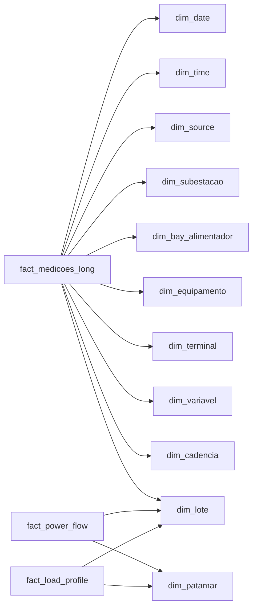

# ANDY BI Semantic Model

## Objetivo

Definir relacoes, medidas permitidas e limites para o modelo semantico do BI.

## Relacoes principais

As tabelas fato se relacionam com `dim_lote`, `dim_source`, `dim_quality_flag`
e dimensoes eletricas/temporais quando as chaves existem. O modelo recomendado
usa cardinalidade many-to-one de fato para dimensao.

## Medidas permitidas no BI

- Contagem de medicoes.
- Distinct count de pontos.
- Disponibilidade publicada pelo ANDY.
- Media simples de valores ja normalizados.
- Indicadores de qualidade.
- Status de lote.

## Medidas que devem vir da engine Python

- MVA.
- FP assinado.
- MW derivado.
- Fluxo P/Q.
- Inversao.
- Patamar.
- Tensao nominal resolvida.
- Fallbacks auditaveis.

## Regra de paridade

Qualquer calculo critico que seja proposto na camada BI precisa de teste de
paridade contra a engine Python antes de ir para homologacao.
