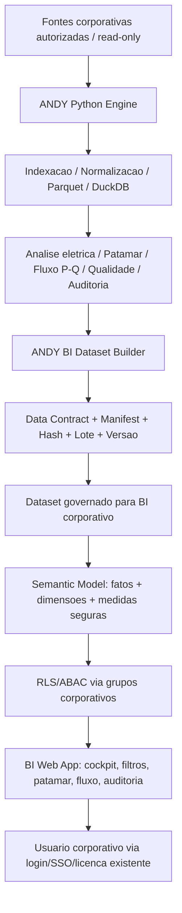

# ANDY BI Web Target Architecture

## Arquitetura alvo

## Leis de arquitetura

- O BI nao acessa fonte bruta diretamente.
- O BI nao monta regra analitica critica.
- O BI consome dataset publicado pelo ANDY.
- O BI pode agregar valores precomputados, mas nao recalcular MVA, FP, MW,
  fluxo P/Q, inversao ou patamar sem teste de paridade.
- Toda publicacao tem lote, hash, schema version, periodo e audit trail.
- Provedor real de identidade so entra por configuracao privada revisada.

## Componentes criados nesta fase

- `andy_bi.data_contract`: contrato versionavel do dataset.
- `andy_bi.dataset_builder`: gerador local governado com fallback sintetico.
- `andy_bi.semantic_model`: relacoes e medidas seguras.
- `andy_bi.rls_policy`: politica deny-by-default para RLS/ABAC.
- `andy_bi.parity`: comparacao de dataset/desktop/XLSX em nivel de resumo.
- `andy_bi.refresh_plan`: contrato de refresh sem gateway real.
- `andy_bi.export_package`: pacote local para revisao de TI/BI.

## Estado atual

Esta arquitetura esta preparada para Dev/Homolog, mas nao publica em ambiente
corporativo. A publicacao depende de workspace, gateway, owners, grupos e
configuracoes privadas aprovadas.
